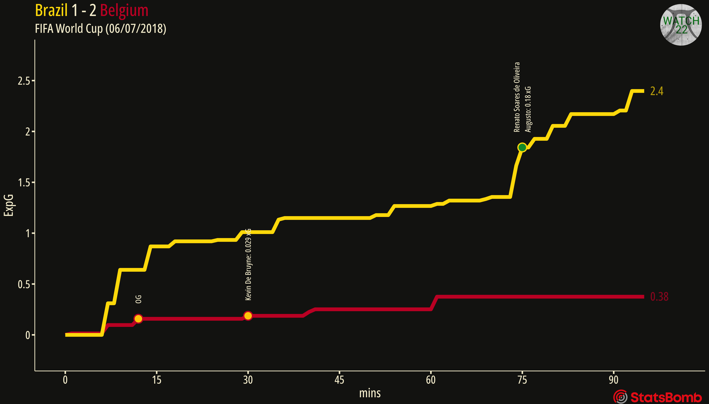
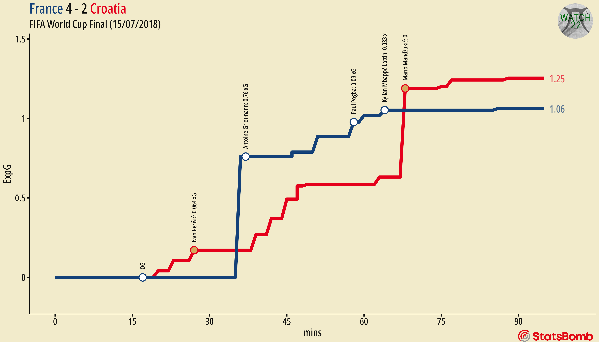

# Sight and Sound: xG Plots

Full article [here](https://medium.com/@watch22/sight-and-sound-xg-plots-786e01be4715)

The first article on Watch 22 goes through the process of manipulating and preparing the data in R, visualising it using ggplot, and sonifying the xG plots for two matches from the 2018 World Cup.

The results provide a very good platform to build on when it comes to sonifying football data and track perfectly with the visualisations. I would go as far as saying that the sonified versions provide a more engaging representation of the xG data.

Listen to the sonified version of this plot [here](https://www.youtube.com/watch?v=Lfty1qTU1Hc)

Listen to the sonified version of this plot [here](https://www.youtube.com/watch?v=eBS37DNd-9g)
